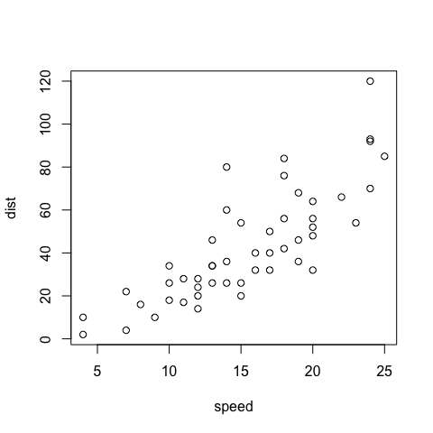

## R Markdown {#nextsteps .emphasized}

With css you have limitless editing capability of your HTML document.
Go to the W3 school (https://www.w3schools.com/css/default.asp)


```r
plot(cars)
```

<!-- -->


## A bulleted list

* Apple
* oranges
* banana

## Equation

$$ Y = \beta_O + \beta_1x $$

The table of contents tracks level 1,2 and 3 headers

for echo = false code chunks, they will never be shown, even when the code folding option is used. If you want to use code folding, set echo equal to TRUE
